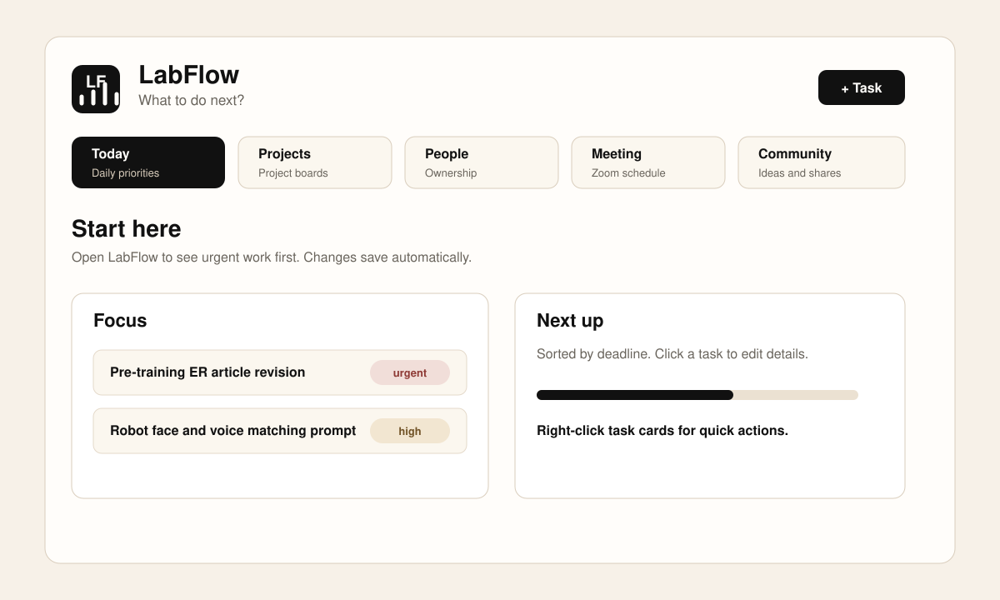
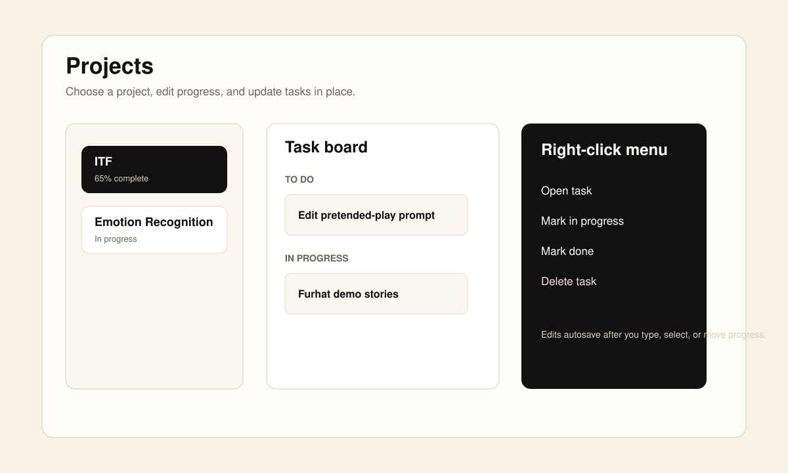
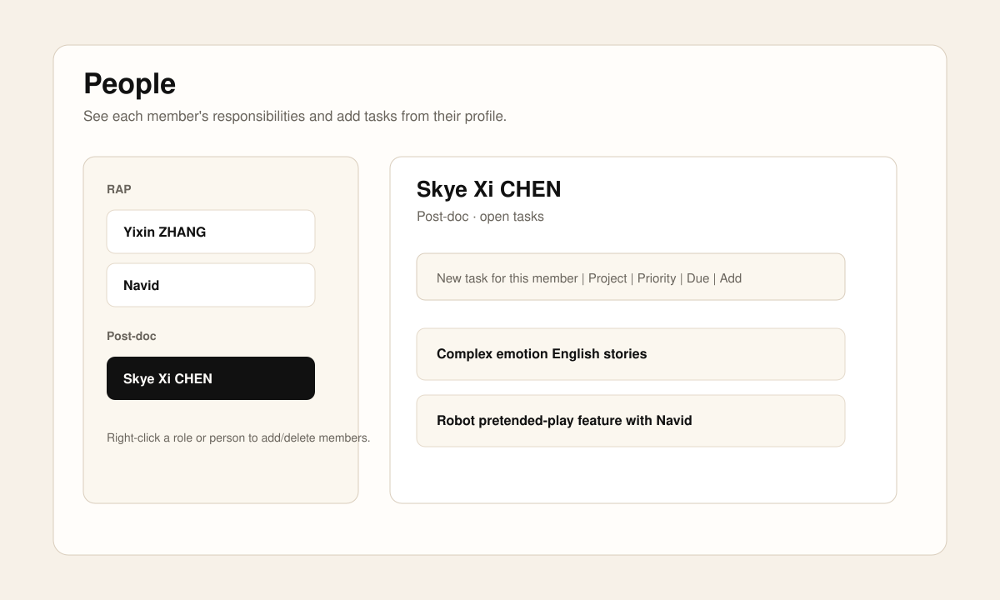
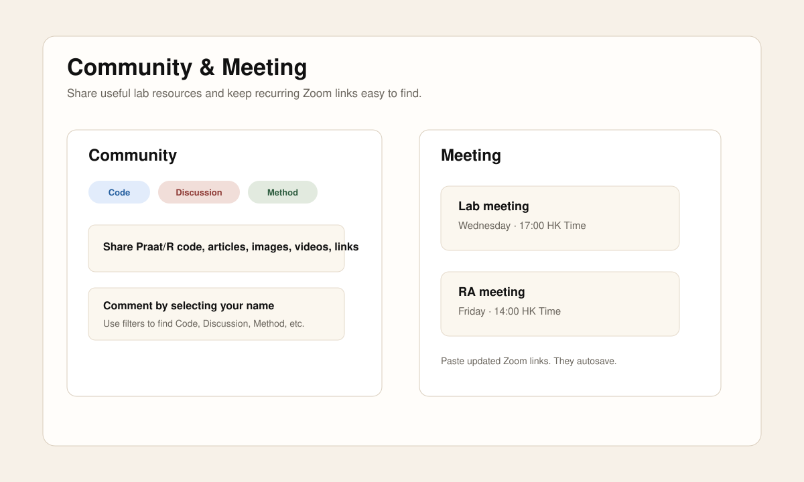

# LabFlow 使用指南 / User Guide

网址 / App URL: [https://labflow-rosy.vercel.app/](https://labflow-rosy.vercel.app/)

LabFlow 是一个给研究组使用的共享任务工作台。它用于整理项目、任务、成员分工、会议链接和 lab 内部资源。  
LabFlow is a shared workspace for a research lab. It helps organize projects, tasks, ownership, meeting links, and reusable lab resources.

## 1. 开始使用 / Start Here

打开网页后，先看 `Today`。这里显示最需要注意的任务和即将到期的任务。

Open the app and start with `Today`. It shows priority work and upcoming tasks.

- 点击任务卡片：打开任务详情 / Click a task card to open details.
- 右键任务卡片：快速删除或修改状态 / Right-click a task card for quick actions.
- 修改内容后会自动保存 / Edits are autosaved.
- 刷新页面可看到最新共享内容 / Refresh to load the latest shared version.

## 2. 管理项目与任务 / Projects And Tasks

进入 `Projects` tab，可以按项目查看任务。每个项目下的任务按状态分组。

Use the `Projects` tab to view tasks by project. Tasks are grouped by status.

常用操作 / Common actions:

- 点击任务：编辑标题、负责人、参与者、优先级、状态、截止日期、备注、checklist、评论和附件。
- 右键任务：打开任务、标记为进行中、标记完成、删除任务。
- 右键项目：编辑项目、修改状态、标记完成、删除项目。
- 拖动项目进度条或修改项目名称后会自动保存。

- Click a task to edit title, owner, participants, priority, status, due date, notes, checklist, comments, and attachments.
- Right-click a task to open it, mark it in progress, mark it done, or delete it.
- Right-click a project to edit, update status, mark complete, or delete it.
- Project name and progress edits autosave.

## 3. 查看成员任务 / People

进入 `People` tab，可以按成员查看任务。适合每天检查每个人接下来要做什么。

Use the `People` tab to view tasks by member. It is useful for daily progress checks.

常用操作 / Common actions:

- 点击成员：查看这个人的所有相关任务。
- 在成员页面顶部添加新任务。
- 一个任务可以有多个参与者。
- 右键成员或角色组：添加或删除成员。

- Click a person to view their related tasks.
- Add a new task from the person page.
- A task can have multiple participants.
- Right-click a person or role group to add or delete members.

## 4. 会议链接 / Meeting

进入 `Meeting` tab，可以找到固定会议链接。

Use the `Meeting` tab to find standing Zoom links.

当前会议 / Current meetings:

- Lab meeting: Wednesday 17:00 HK Time
- RA meeting: Friday 14:00 HK Time

修改 Zoom link 后会自动保存。  
Zoom link changes are autosaved.

## 5. Community 分享区 / Community

`Community` 用来分享文章、代码、方法、图片、视频、网页链接、RStudio 配色或任何对 lab 有帮助的资源。

`Community` is for sharing articles, code, methods, images, videos, web links, RStudio palettes, or any resource useful to the lab.

常用操作 / Common actions:

- 发布帖子：填写标题、类型、作者、内容，可选链接、文件或代码。
- 筛选帖子：查看所有 Code、Discussion、Method 等不同类型。
- 评论帖子：选择人物后添加评论。
- 收藏帖子：点击 Save。

- Publish a post with title, type, author, content, optional link, file, or code.
- Filter posts by Code, Discussion, Method, and other types.
- Add comments by selecting a member name.
- Save useful posts with `Save`.

## 6. 自动保存与协作 / Autosave And Collaboration

LabFlow 会自动保存主要编辑内容到 Supabase 云端数据库。多人使用时，大家看到的是同一份共享数据。

LabFlow autosaves main edits to the Supabase cloud database. Multiple users work on the same shared data.

注意 / Notes:

- 刷新页面可以看到最新内容。
- 如果两个人同时编辑同一个字段，最后保存的人会覆盖前一个版本。
- 大文件上传建议控制在 50 MB 以内。
- 目前是轻量协作版，不包含完整权限控制和版本历史。

- Refresh the page to load the latest content.
- If two people edit the same field at the same time, the latest save wins.
- Keep uploaded files under 50 MB when possible.
- This is a lightweight collaboration version without full permission control or version history yet.

## 7. 推荐日常流程 / Recommended Daily Workflow

1. 打开 `Today`，看最紧急任务。  
   Open `Today` and check urgent tasks.

2. 进入 `Projects`，更新项目状态和任务进度。  
   Go to `Projects` and update project/task progress.

3. 进入 `People`，确认自己名下和共同参与的任务。  
   Go to `People` and check your own and shared tasks.

4. 在 `Community` 分享有用材料或提出问题。  
   Share resources or questions in `Community`.

5. 每周会议前检查 `Meeting` 链接。  
   Check `Meeting` links before weekly meetings.
